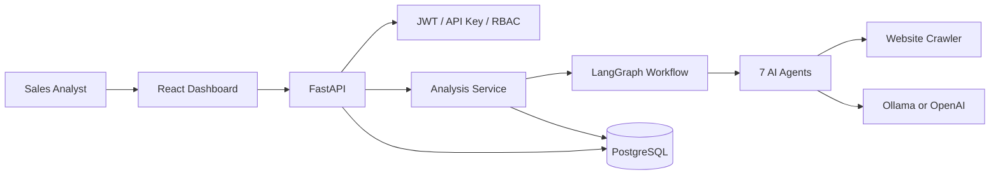
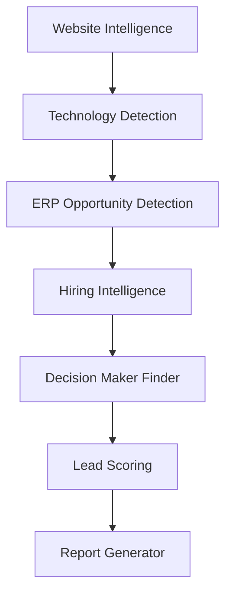

# Architecture

## System context

## Agent pipeline

## Design principles

- **Clean architecture** — API → services/agents → repositories → models
- **Local-first AI** — Ollama default; heuristics keep the app usable offline
- **Provider swap** — `LLM_PROVIDER=ollama|openai` only
- **Async I/O** — FastAPI + SQLAlchemy async + httpx crawler
- **Repository pattern** — no SQL in routers
- **Config via `.env`** — no hardcoded secrets in code

## Data model (core)

- `companies` — prospect firmographics  
- `analysis` — one pipeline run + JSONB agent payloads  
- `technologies` / `contacts` / `lead_scores` / `reports` — structured outputs  
- `crawl_logs` / `jobs` — operational audit  
- `users` / `settings` — auth and configuration  

## Frontend surfaces

Company Search · Company Details · Website Analysis · Lead Score · Decision Makers · Technology Stack · ERP Detection · Hiring Analysis · News · Export CSV · Export Excel
